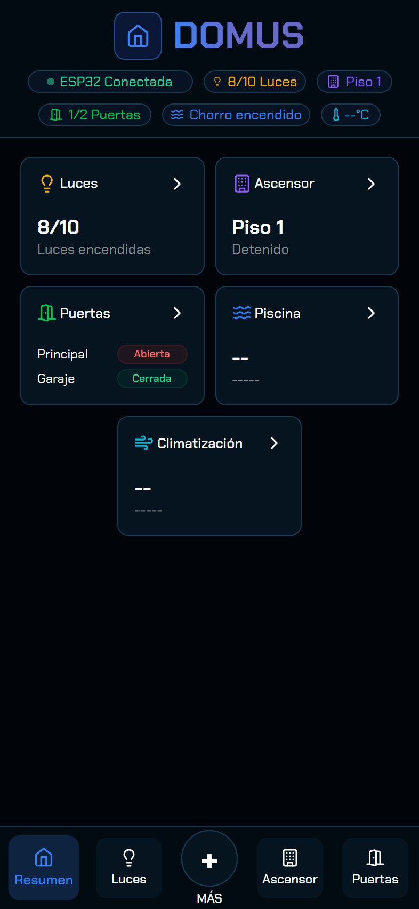
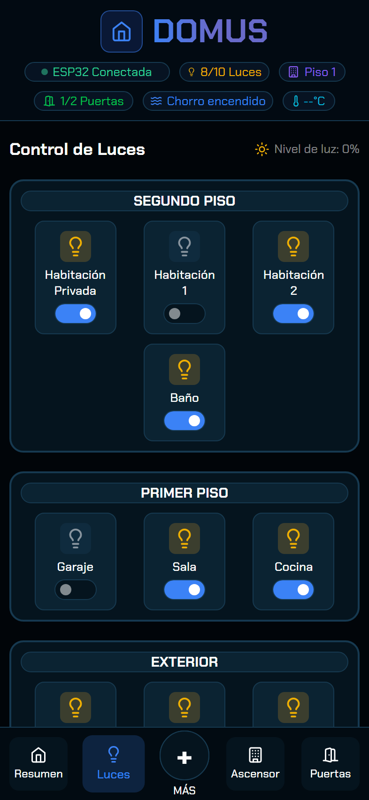
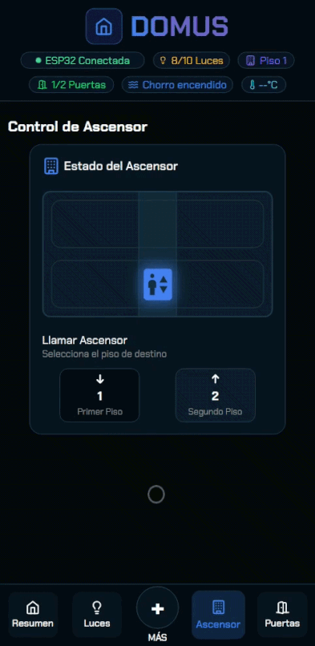
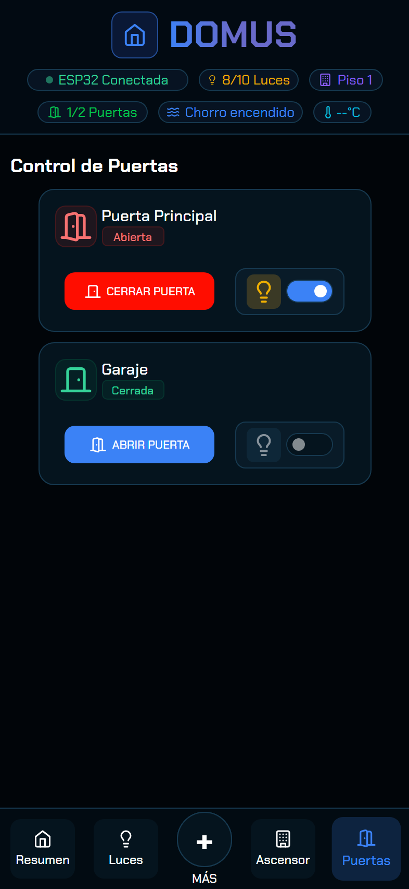
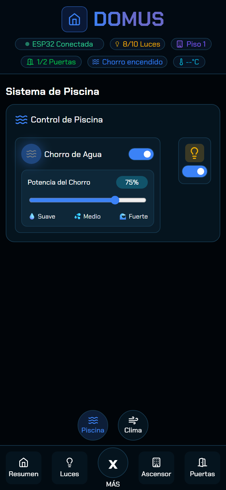
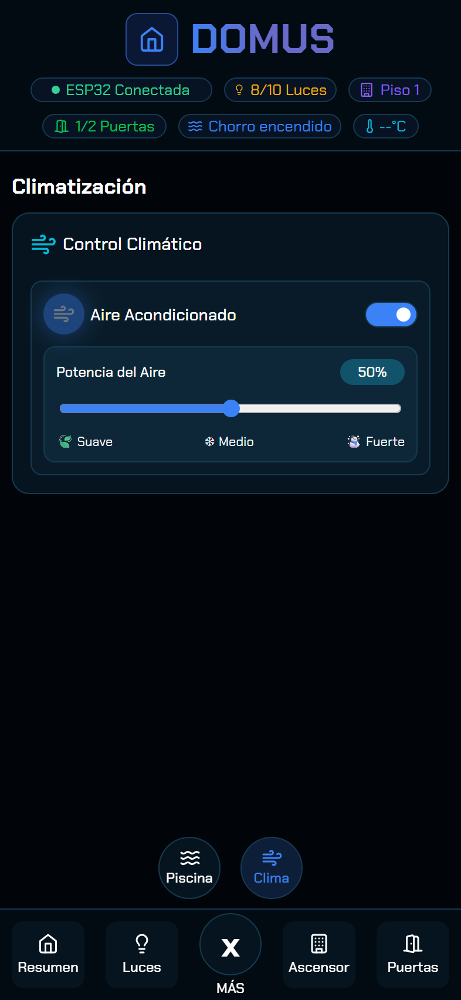

<h1 align="center"><b> EAMControl - VISUAL OVERVIEW </b></h1>

Development of a working smart home prototype that can be controlled via a web app. The project demonstrates the successful integration of hardware and software, linking an ESP32 microcontroller to a real-time database on Firebase for sending and receiving physical commands. It allows users to control and monitor the status of electronic components via this interactive app.
  

  <table>
    <tr>
      <td align="center"><b>SUMMARY</b> General view of the system</td>
      <td align="center"><b>LIGHTS</b> Real-time lighting control</td>
      <td align="center"><b>ELEVATOR</b> Monitoring movement</td>
    </tr>
    <tr>
      <td></td>
      <td></td>
      <td></td>
    </tr>
    <tr height="40"></tr>
    <tr>
      <td align="center"><b>DOORS</b> Security and access status</td>
      <td align="center"><b>POOL</b> Jet power and light</td>
      <td align="center"><b>WEATHER</b> Air conditioning power</td>
    </tr>
    <tr>
      <td></td>
      <td></td>
      <td></td>
    </tr>
  </table>

